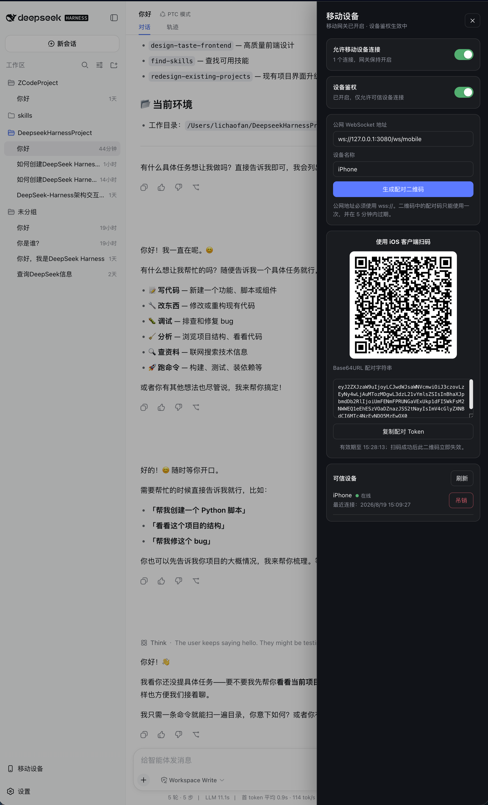

# dsh-plugin-mobile-gateway

为 [DeepSeek Harness](https://github.com/deepseek-ai/deepseek-harness) 提供经过设备鉴权的持久化 WebSocket 网关，让 iOS 等移动客户端能够查看工作区和历史会话、接收 Agent 实时输出、发送任务，以及调整会话模型与权限。



- WebSocket 端点：`/ws/mobile`
- 管理入口：Harness WebUI 左侧边栏底部的“移动设备”
- 默认安全策略：网关默认关闭、设备鉴权默认开启、管理接口仅允许本机访问
- 完整通信格式：[`PROTOCOL.md`](PROTOCOL.md)

## 直接安装（推荐，无需下载源码）

### 1. 安装插件

确保本机已经安装并能正常运行 DeepSeek Harness，然后执行：

```bash
dsh plugin --profile web add dsh-plugin-mobile-gateway
```

这条命令会直接从 npm 获取插件、安装依赖，并将插件加入 `web` profile 的 bundle 列表。用户不需要 clone 仓库，也不需要运行 `pnpm install`。

如果希望固定版本，可以在包名后指定版本号：

```bash
dsh plugin --profile web add dsh-plugin-mobile-gateway@0.4.1
```

也可以不经过 npm，直接安装 GitHub 版本：

```bash
dsh plugin --profile web add github:Clarklevis1995/dsh-plugin-mobile-gateway
```

### 2. 重启 Harness WebUI

插件组合树只在 WebUI 启动时加载。安装完成后，停止当前的 `dsh web` 进程并重新启动它。刷新浏览器本身不足以加载新安装的服务端插件。

可以在启动前检查插件是否进入组合配置：

```bash
dsh --profile web --dump-config | grep -A3 mobile-gateway
```

启动 WebUI 后，左侧边栏底部应出现“移动设备”入口。

### 3. 一条命令配置公网 IP（推荐，无需域名）

如果 Harness 部署在带固定公网 IPv4 的腾讯云 Ubuntu/Debian 服务器上，先在腾讯云安全组中放行入站 TCP `80` 和 `443`，然后在服务器执行：

```bash
sudo npx --yes dsh-plugin-mobile-gateway setup
```

安装器会自动从腾讯云实例元数据读取公网 IPv4，并完成：

- 安装 Nginx 和独立 Python 虚拟环境中的 Certbot
- 为公网 IP 申请受系统信任的短期 TLS 证书
- 只把 `wss://公网IP/ws/mobile` 代理到 `127.0.0.1:3080`
- 对普通 HTTP、WebUI、`/mgw/*` 管理接口和其他路径返回 `404`
- 创建每天两次运行的 systemd 证书续期任务
- 把公网地址写入 `/etc/dsh-mobile-gateway/public-url`，插件启动时自动读取

因此 DSH 仍然只需监听 `127.0.0.1:3080`，不需要把 3080 端口暴露到公网，也不需要 Tunnel、域名或手写 Nginx 配置。

邮箱是可选项；希望接收 Let's Encrypt 账户通知时可追加 `--email you@example.com`。如果无法从腾讯云元数据识别公网地址，或 DSH 使用了其他本地端口：

```bash
sudo npx --yes dsh-plugin-mobile-gateway setup \
  --ip 203.0.113.10 \
  --port 3080 \
  --email you@example.com
```

执行完成后重启 `dsh web`，打开 WebUI 的“移动设备”面板。公网 WebSocket 地址会自动显示为 `wss://公网IP/ws/mobile`；开启移动网关并生成二维码即可。

查看状态或移除安装器生成的公网入口：

```bash
sudo npx --yes dsh-plugin-mobile-gateway status
sudo npx --yes dsh-plugin-mobile-gateway remove
```

`remove` 只删除本插件生成的 Nginx 配置、地址文件和续期任务，不卸载软件，也不删除已有证书。IP 证书有效期约 6 天，必须保持 80 端口可达以便自动续期。相关能力来自 [Let's Encrypt 的短期 IP 地址证书](https://letsencrypt.org/2026/03/11/shorter-certs-certbot/)；公网 IP 自动识别使用[腾讯云实例元数据](https://cloud.tencent.com/document/product/213/17940)。

#### 已有域名或反向代理

打开“移动设备”面板：

1. 开启“允许移动设备连接”。
2. 保持“设备鉴权”开启。
3. 在“公网 WebSocket 地址”中填写手机可以访问的地址。

本机浏览器调试可以使用：

```text
ws://127.0.0.1:3080/ws/mobile
```

真机不能使用 `127.0.0.1`，因为它在手机上指向手机自身。局域网或公网真机连接应通过 TLS 反向代理提供：

```text
wss://gateway.example.com/ws/mobile
```

非 localhost 的配对地址会强制要求 `wss://`，以免一次性配对信息和长期连接暴露在明文网络中。

### 4. 配对 iOS 客户端

1. 在 WebUI 中填写设备名称，例如 `iPhone`。
2. 点击“生成配对二维码”。
3. 在 iOS 客户端首页点击认证按钮：
   - 选择“扫描二维码”，扫码后自动连接；或
   - 选择“手动输入配对信息”，粘贴 WebUI 中复制的 Base64URL 配对 Token，再点击连接。
4. iOS 首次连接成功后会把长期设备凭证保存到 Keychain。配对二维码只能使用一次，并会在 5 分钟后过期。
5. WebUI 的可信设备列表显示“在线”，iOS 首页连接状态变为绿色，即表示连接完成。

后续启动 iOS 客户端时会使用 Keychain 中的长期凭证重新连接，不需要再次扫码。重新配对同一套 iOS 安装也会复用其设备身份，不会重复创建可信设备。

## 日常使用

连接成功后，移动客户端可以：

- 浏览工作区、未分组会话和服务端目录
- 创建工作区与新会话
- 加载历史消息与轨迹
- 实时接收思考、工具调用和最终回答
- 向远端 Agent 发送任务
- 查询或切换会话模型、推理等级和访问权限
- 查看上下文用量与会话统计

关闭“允许移动设备连接”会立即断开移动端，但不会影响普通 Harness WebUI。网关开启后，如果默认 5 分钟内没有可信设备成功连接，会自动关闭。

## 可信设备管理

长期设备凭证只在首次配对成功时返回一次，移动端应保存在 Keychain。服务端仅保存凭证的 SHA-256 摘要：

```text
~/.dsh/mobile-gateway-devices.json
```

在 WebUI 的“可信设备”列表中点击“吊销”会：

- 从可信设备列表删除该设备
- 立即关闭该设备现有的 WebSocket 连接
- 使该设备保存的长期凭证永久失效

被吊销的设备再次连接会收到 `401 Unauthorized`，需要重新配对。

## 更新插件（无需源码）

插件会被安装到 profile 中，不会自动更新。升级时重新安装最新 npm 版本并重启 WebUI：

```bash
dsh plugin --profile web remove dsh-plugin-mobile-gateway
dsh plugin --profile web add dsh-plugin-mobile-gateway
```

然后停止并重新启动 `dsh web`。

## 卸载

```bash
dsh plugin --profile web remove dsh-plugin-mobile-gateway
```

如果旧版 DSH 没有自动清理 bundle，再从 `~/.dsh/profiles/web/package.json` 的 `dsh.profile.bundles` 中删除 `dsh-plugin-mobile-gateway`，随后重启 WebUI。

卸载插件不会自动删除 `~/.dsh/mobile-gateway-devices.json`。

## 手动公网部署

不使用一键安装器时，公网入口应由 Nginx、Caddy 或其他反向代理提供 HTTPS/WSS，并且只公开 WebSocket 路由，不要公开 `/mgw` 管理接口或整个未鉴权 WebUI。

Nginx 核心配置示例：

```nginx
location = /ws/mobile {
    proxy_pass http://127.0.0.1:3080;
    proxy_http_version 1.1;
    proxy_set_header Upgrade $http_upgrade;
    proxy_set_header Connection "upgrade";
}
```

TLS 证书、域名、防火墙、访问日志保护和代理层速率限制由部署环境负责。

如需把公网地址写入 profile，可在 `cordis.patch.yml` 的 `mobile-gateway` 配置段覆盖：

```yaml
- id: mobile-gateway
  config:
    path: /ws/mobile
    gatewayEnabled: false
    gatewayWaitTimeoutMs: 300000
    requireAuth: true
    adminLoopbackOnly: true
    publicUrl: wss://gateway.example.com/ws/mobile
    publicUrlFile: /etc/dsh-mobile-gateway/public-url
    pairingTtlMs: 300000
    allowQueryToken: false
```

后置 patch 会替换整个配置段，因此覆盖时应保留所有需要的字段。

## 常见问题

| 现象 | 原因与处理方式 |
|---|---|
| WebUI 没有“移动设备”入口 | 确认使用 `--profile web` 安装；执行 `--dump-config` 检查组合树，然后完整重启 `dsh web` |
| iOS 连接提示 `503` | 移动网关尚未开启，回到 WebUI 开启“允许移动设备连接” |
| iOS 连接提示 `401` | 配对码过期、长期凭证无效或设备已被吊销；删除客户端旧凭证后重新配对 |
| 真机无法连接 `127.0.0.1` | `127.0.0.1` 在手机上不是电脑；配置手机可访问的 `wss://` 地址 |
| 一键配置无法识别公网 IP | 确认命令运行在腾讯云 CVM 内，或通过 `--ip <公网 IPv4>` 显式指定 |
| Certbot 申请或续期失败 | 确认腾讯云安全组和服务器防火墙都允许入站 TCP 80/443，并确认公网 IP 没有变化 |
| 想检查自动续期 | 执行 `sudo systemctl status dsh-mobile-gateway-cert-renew.timer` 和 `sudo npx --yes dsh-plugin-mobile-gateway status` |
| 二维码无法再次使用 | 配对码设计为一次性且 5 分钟过期，重新生成即可 |
| 修改配置后没有生效 | 插件与 profile composition 在启动时加载，需要重启 WebUI 进程 |
| 需要排查服务端原因 | 查看 `/tmp/mobile-gateway.log`，其中包含连接、鉴权、查询与错误记录 |

## 安全说明

- 不建议关闭设备鉴权。该开关仅用于本机 Debug，重启后会恢复安全默认值。
- `/mgw/*` 默认只接受 loopback 请求，不应通过公网反向代理暴露。
- 长期 token 默认禁止通过 URL query 传输，避免进入代理日志、浏览器历史或监控系统。
- 配对二维码和长期 token 不会明文写入服务端磁盘。

## 源码开发

只有需要修改插件本身时才需要源码安装：

```bash
dsh plugin --profile web add file:/absolute/path/to/dsh-plugin-mobile-gateway
```

`file:` 是复制安装。修改源码后必须先 remove、再 add，并重启 WebUI；不要使用 `link:`，否则依赖可能从源码目录解析而导致 `ws` 等包无法找到。

测试命令：

```bash
# 鉴权、配对与吊销
NODE_PATH=/path/to/dsh/node_modules node test/auth.test.mjs

# mock Harness + 真实 WebSocket 客户端的完整协议链路
NODE_PATH=/path/to/dsh/node_modules node test/gateway.test.mjs

# 公网 IP 安装器的参数、Nginx 隔离与续期配置
node test/setup-ip.test.mjs
```

版本历史与全部 WebSocket 消息类型见 [`PROTOCOL.md`](PROTOCOL.md)。
